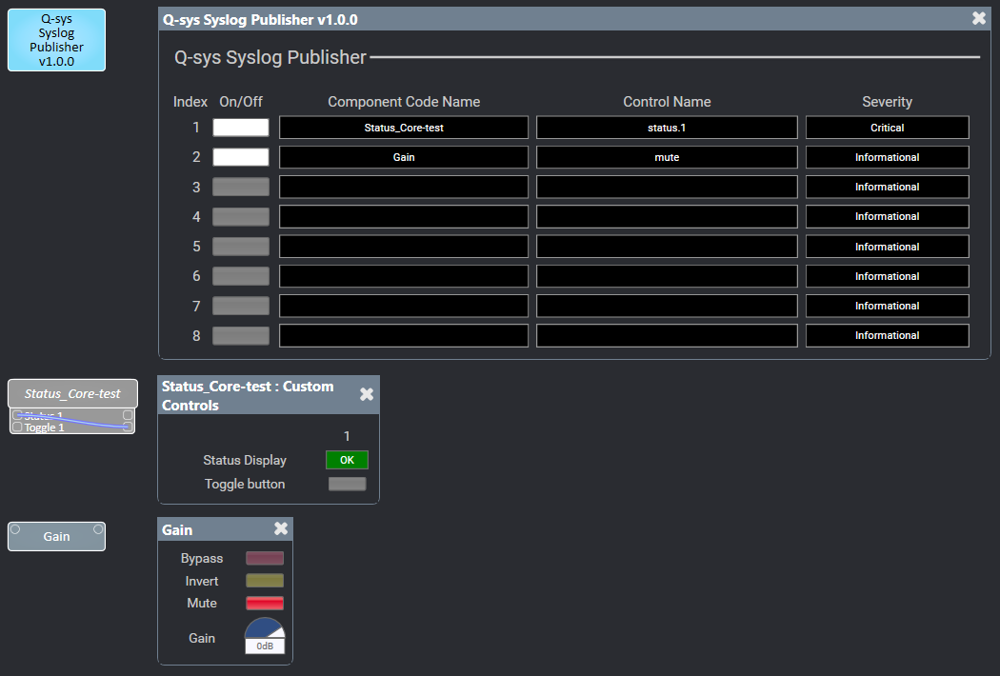
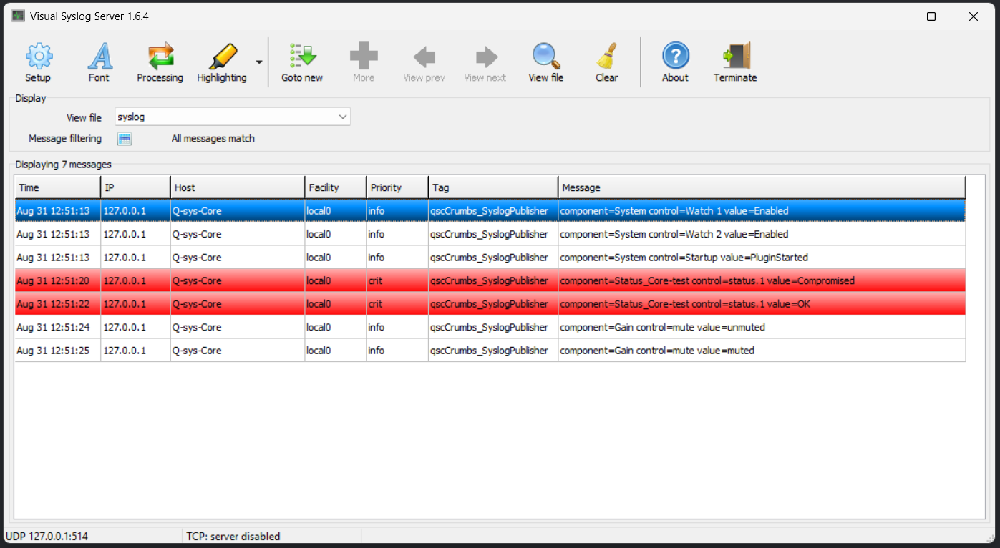

# Crumbs: Q-sys Syslog Publisher
## Description
Q-sys Syslog Publisher is a Q-sys tool/plugin that **watches** user-selected controls within a running Q-sys design and **generates** and **publishes** syslog messages to an external syslog server.

*Crumbs are transparent (meaning the content/plugin is not hidden/encrypted and the code is opened and visible) tools that try to solve a simple/specific problem while being lightweight.*

<p align="center">
  
  
</p>

## Aim
The aim is to:
- Help monitoring several controls in a running Q-sys design in one single place,
- Allow for a more systematic troubleshooting with better overview, and
- Potentially contribute positively for a meaningful integration of Q-sys-based AV systems with/into existing IT environment

## How
This Q-sys tool/plugin enables:
- Watching status changes of a user-selected control(s) from deployed components within a running Q-sys design passively
- Generating legacy syslog (RFC 3164)
- Publishing/sending the generated syslog to an external/existing syslog server

## Setting up
### Installation
1. Download the released .qplug file
2. Double click the file to install the plugin or move the file to the QSC plugin folder, usually found at C:\Users\[username]\Documents\QSC\Q-Sys Designer\Plugins

*The plugin was tested in Q-sys designer v9.13.1 and upwards.*

### Configuration
#### Properties
1. Open a Q-sys designer
2. Find the plugin named Syslog Publisher under qscCrumbs
3. Drag the plugin onto a schematic page and select it by clicking once
4. Ensure Syslog is enabled in the properties, which is set to "Yes" by default
5. Set the correct Syslog Server IP and Port address in the properties
6. Enter a suitable Hostname in the properties, which will be included in the syslog message
7. Enter the amount of Watch Counts between 1 and 32 as needed, which is set to 8 by default and limited up to 32 for now (Variable called "MAX_NUM_OF_WATCHES" in the code)
8. Set the Facility as required, which is set to "Local0" by default (or ask the IT administrator for the correct Facility in your AV/IT environment)

#### Controls
1. Open the plugin by a double-click
2. Enter the correct Component Code Name, which can be found in the properties of the component you wish to watch or by turninig ON the Script Programmer Mode under Tools at the top menu
3. Enter the correct Control Name you wish to watch, which can be found in the View Component Controls Info under Tools at the top menu, ensure you click once on the component you wish to watch to display the list of controls and that you use the system name and not the pretty name within parenthesis
4. Select the desired Severity level, which is set to "Information" by default
5. Ensure the Script Access of the component you wish to watch is set to "All" in the properties
6. Turn On/Off toggle button ON to start watching the control you wish to watch

#### Validation
1. Once the plugin is online in the running Q-sys design, it will generate and send out an initiation message to the syslog server:
```text
<134>[Date] [Time] [Hostname] qscCrumbs_SyslogPublisher: component=System control=Startup value=PluginStarted
```

2. When the correct Component Code Name and Control Name are entered, the debug output should print, but not send anything out to the syslog server, the following:
```text
Watch 1 is configured: [Component Code name].[Control Name] ([Severity])
```

3. Once a watch is turned ON, the plugin generates and sends out to the syslog server the following:
```text
<134>[Date] [Time] [Hostname] qscCrumbs_SyslogPublisher: component=System control=Watch 1 value=Enabled
```

For example:
```text
<134>Jul 23 21:46:54 Q-sys-Core qscCrumbs_SyslogPublisher: component=System control=Startup value=PluginStarted
```
